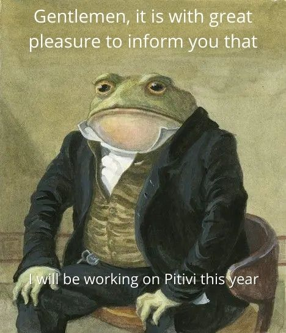

Hey! I'm Thejas Kiran P S, a sophomore pursuing my Bachelor's in
Computer Science. I have been selected to GNOME organization as a GSoC'22
contributor and will be working on Pitivi. Pitivi is a non-linear video editor based on the GStreamer Editing
Services library.

My work here will be to improve the Timeline
component of the application by solving currently open issues and
other bugs (Also introduce some new features maybe? ;)

That's all for now. See you later!
